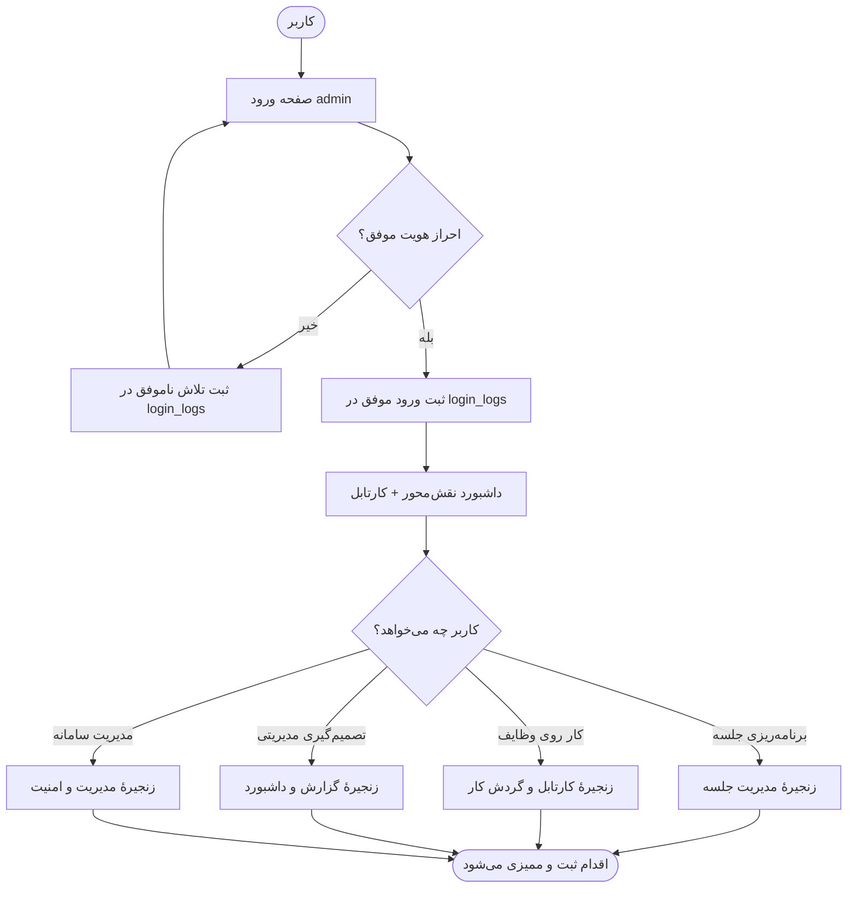
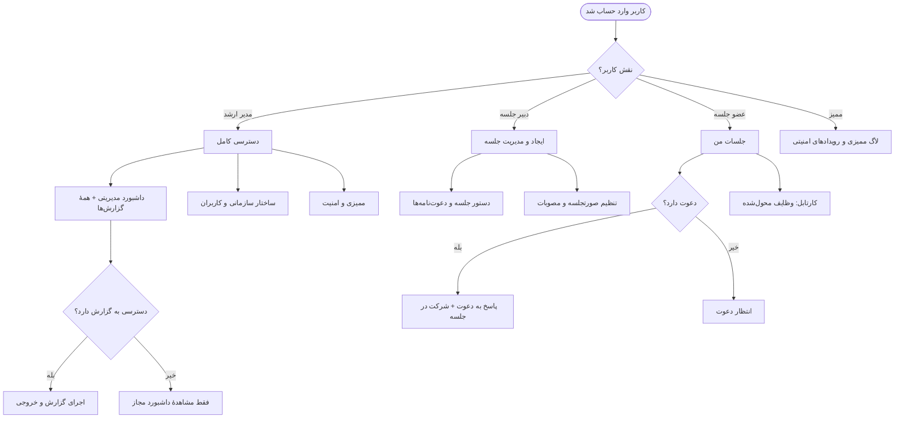
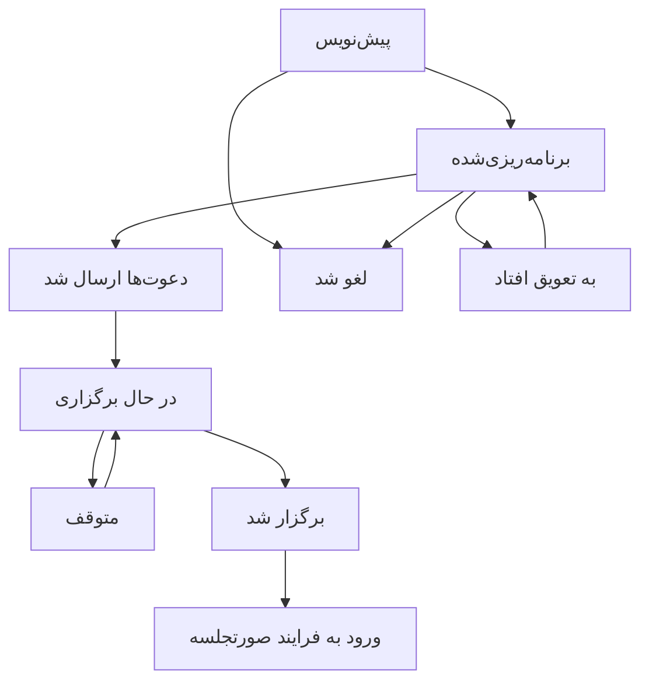
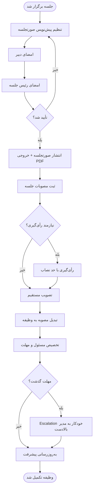
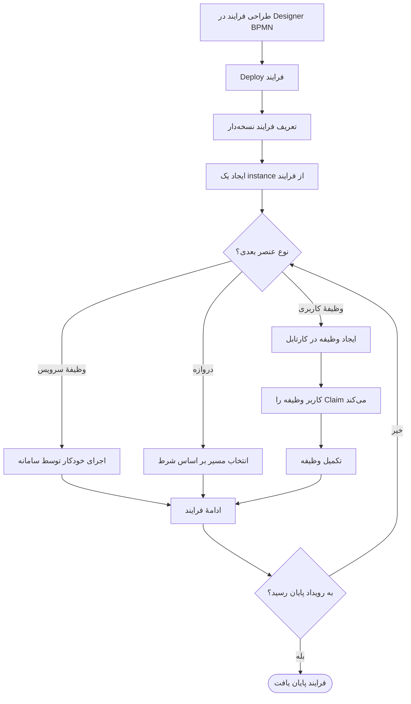
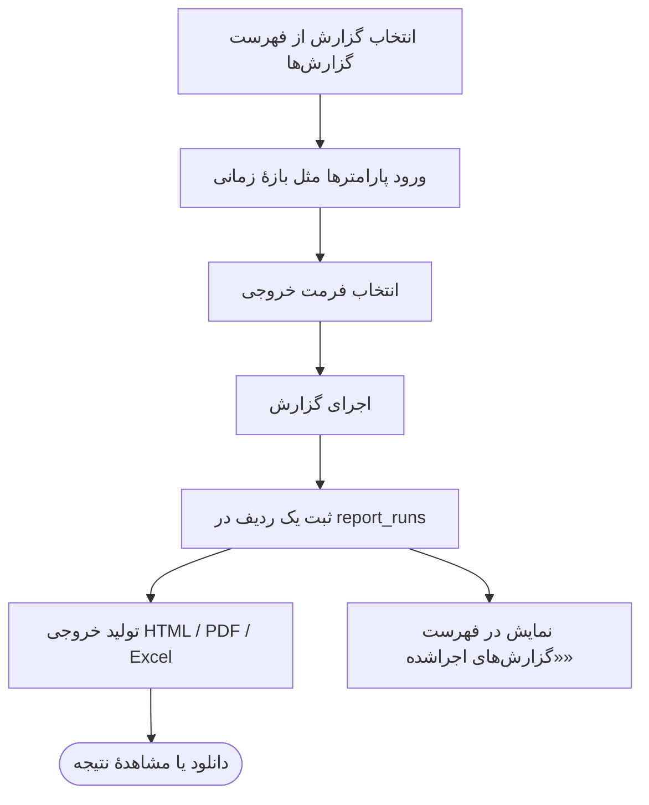
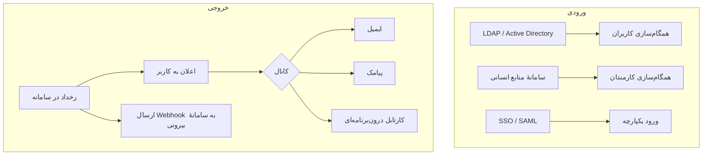

# سند چارت فرایند پروژه (سامانه مدیریت جلسات)

این سند، **فرایند کلی استفاده از سامانه** را به‌صورت چارت‌محور توضیح می‌دهد:
کاربر از کجا شروع می‌کند، بر اساس نقش به کدام بخش می‌رود، و هر ماژول چه نقشی در
زنجیرهٔ کار دارد. هدف این است که با یک نگاه مشخص شود **چه چیزهایی در پروژه پیاده‌سازی
شده و نقش هر بخش چیست**.

> چارت‌ها با **Mermaid** کشیده شده‌اند و در GitHub به‌صورت گرافیکی نمایش داده می‌شوند.

---

## ۱. راهنمای خواندن

- مستطیل = یک صفحه/اقدام
- لوزی = یک تصمیم/شرط (معمولاً بر اساس نقش یا دسترسی)
- بیضی = نقطهٔ شروع یا پایان
- هر چارت در پایان یک بخش «نقش هر قسمت» دارد.

---

## ۲. چارت کلان: از ورود تا اقدام

نمای پرنده از کل سامانه — کاربر وارد می‌شود، داشبورد نقش‌محور می‌بیند و وارد یکی از
زنجیره‌های اصلی کار می‌شود.



**نقش هر قسمت:**
- **ورود و login_logs:** دروازهٔ امنیتی؛ هر ورود موفق/ناموفق ثبت می‌شود.
- **داشبورد نقش‌محور:** نقطهٔ شروع همه؛ ویجت‌ها بر اساس نقش متفاوت‌اند.
- **چهار زنجیرهٔ اصلی:** کل کارکرد سامانه در همین چهار مسیر خلاصه می‌شود.
- **ممیزی:** همهٔ اقدام‌ها در audit_logs ثبت می‌شوند (لایهٔ زیرین و همیشگی).

---

## ۳. چارت مسیریابی نقش‌محور

این چارت پاسخ می‌دهد: «بعد از ورود، هر نقش کجا می‌رود و چه کاری می‌تواند بکند؟»



**نقش هر قسمت:**
- **نقش‌ها و مجوزها (ماژول Identity):** تعیین می‌کنند هر کاربر کدام مسیر را می‌بیند.
  منوی کناری بر اساس همین مجوزها فیلتر می‌شود.
- **مدیر ارشد:** نقش `super-admin` به همه‌چیز دسترسی دارد.
- **دبیر جلسه:** موتور محرک چرخهٔ جلسه است.
- **عضو جلسه:** مصرف‌کنندهٔ دعوت‌نامه و وظایف؛ کمترین دسترسی.
- **ممیز:** فقط‌خواندنی روی لاگ‌ها.
- **شرط دسترسی:** اگر کاربر مجوز `report.view` نداشته باشد، فقط داشبورد را می‌بیند نه
  اجرای گزارش — همان مثالی که در صورت سؤال آمده بود.

---

## ۴. نقشه ماژول‌ها و نقش هر بخش

این چارت نشان می‌دهد ماژول‌ها چگونه به هم وصل‌اند و هرکدام چه نقشی دارند.

```mermaid
flowchart LR
    subgraph پایه
        ID[هویت و دسترسی]
        ORG[ساختار سازمانی]
    end

    subgraph هستهٔ جلسات
        MTG[جلسات]
        CAL[تقویم]
        ROOM[سالن‌ها]
        INV[دعوت‌نامه‌ها]
        VC[ویدئوکنفرانس]
    end

    subgraph پس از جلسه
        MIN[صورتجلسات]
        RES[مصوبات]
        TASK[وظایف]
    end

    subgraph اتوماسیون
        WF[گردش کار BPMN]
        INBOX[کارتابل]
        NOTIF[اعلان‌ها]
    end

    subgraph تحلیل و نظارت
        REP[گزارش‌ها]
        DASH[داشبوردها]
        AUDIT[ممیزی و امنیت]
    end

    subgraph ارتباطات
        INTG[یکپارچه‌سازی]
        SR[درخواست‌های جانبی]
    end

    ID --> MTG
    ORG --> MTG
    CAL --> MTG
    ROOM --> MTG
    MTG --> INV
    MTG --> VC
    MTG --> MIN
    MIN --> RES
    RES --> TASK
    WF --> INBOX
    WF --> TASK
    MTG --> NOTIF
    TASK --> NOTIF
    INV --> NOTIF
    MTG --> REP
    TASK --> REP
    REP --> DASH
    INTG --> ID
    MTG --> SR
    MTG --> AUDIT
    TASK --> AUDIT
```

**نقش هر ماژول:**

| ماژول | نقش در فرایند |
|---|---|
| هویت و دسترسی | کاربران، نقش‌ها، مجوزها، تفویض اختیار — کنترل می‌کند چه کسی چه کاری می‌کند |
| ساختار سازمانی | سازمان، واحدها، پست‌ها، کارمندان — مرجع «چه کسی در کجا» |
| جلسات | هستهٔ سامانه — چرخهٔ کامل یک جلسه |
| تقویم | نمای زمانی جلسات و ایجاد سریع |
| سالن‌ها | تعریف سالن و تشخیص تداخل رزرو |
| دعوت‌نامه‌ها | مدیریت دعوت و پاسخ شرکت‌کنندگان |
| ویدئوکنفرانس | اتصال جلسهٔ آنلاین به سرویس‌دهنده |
| صورتجلسات | سند رسمی نتیجهٔ جلسه با امضا و انتشار |
| مصوبات | تصمیمات رسمی + رأی‌گیری |
| وظایف | کارهای محول‌شده با مهلت و پیگیری |
| گردش کار BPMN | فرایندهای خودکار قابل طراحی |
| کارتابل | صندوق وظایف کاربری تولیدشده توسط گردش کار |
| اعلان‌ها | اطلاع‌رسانی چندکاناله به کاربران |
| گزارش‌ها | گزارش‌های آمادهٔ آماری با خروجی |
| داشبوردها | ویجت‌های نقش‌محور |
| ممیزی و امنیت | ثبت همهٔ رویدادها و لاگ ورود |
| یکپارچه‌سازی | اتصال به LDAP/SSO/HRS و Webhook |
| درخواست‌های جانبی | درخواست خدمات مرتبط با جلسه |

---

## ۵. فرایند چرخهٔ عمر جلسه

ماشین حالت یک جلسه از ایجاد تا برگزاری.



**نقش هر مرحله:**
- **پیش‌نویس:** جلسه ساخته شده ولی نهایی نیست؛ هنوز قابل ویرایش کامل است.
- **برنامه‌ریزی‌شده:** زمان و سالن تثبیت شد؛ رزرو سالن انجام می‌شود.
- **دعوت‌ها ارسال شد:** شرکت‌کنندگان مطلع شده‌اند.
- **در حال برگزاری / متوقف:** وضعیت‌های زمان اجرا.
- **برگزار شد:** ورودی فرایند پس از جلسه.
- **لغو/تعویق:** مسیرهای جایگزین.

---

## ۶. فرایند پس از جلسه

از صورتجلسه تا وظایف قابل پیگیری.



**نقش هر قسمت:**
- **صورتجلسه:** نسخه‌بندی و امضای دومرحله‌ای؛ پس از انتشار تغییرناپذیر می‌شود.
- **مصوبات:** تصمیم رسمی؛ رأی‌گیری اختیاری با حد نصاب.
- **وظایف:** خروجی قابل پیگیری مصوبه؛ Escalation تضمین می‌کند کارها زمین نمی‌مانند.

---

## ۷. فرایند گردش کار و کارتابل

طراحی فرایند BPMN و اجرای آن تا رسیدن وظیفه به کارتابل کاربر.



**نقش هر قسمت:**
- **Designer BPMN:** ابزار طراحی گرافیکی فرایند.
- **تعریف فرایند:** نسخهٔ منتشرشده و قابل اجرا.
- **Instance:** یک اجرای زندهٔ فرایند.
- **وظیفهٔ کاربری ↔ کارتابل:** نقطهٔ تماس انسان با گردش کار.
- **وظیفهٔ سرویس:** گام‌های خودکار بدون دخالت انسان.

---

## ۸. فرایند گزارش‌گیری



**نقش هر قسمت:**
- **تعریف گزارش:** فقط الگو است؛ هیچ داده‌ای ندارد.
- **اجرای گزارش (report_run):** هر بار اجرا یک رکورد می‌سازد — به همین دلیل فهرست
  «گزارش‌های اجراشده» تا اولین اجرا خالی است.
- **داشبورد:** همان داده‌ها را به‌صورت ویجت زنده نشان می‌دهد.

---

## ۹. فرایند یکپارچه‌سازی و اعلان‌ها



**نقش هر قسمت:**
- **یکپارچه‌سازی ورودی:** کاربران/کارمندان را از سامانه‌های دیگر می‌آورد.
- **اعلان‌ها:** ارتباط با انسان‌ها.
- **Webhook:** ارتباط ماشین‌به‌ماشین با سامانه‌های بیرونی.

---

## ۱۰. جمع‌بندی: مسیر پیشنهادی بر اساس نقش

| نقش | اولین مقصد بعد از ورود | مسیر اصلی کار |
|---|---|---|
| مدیر ارشد | داشبورد مدیریتی | گزارش‌ها ← تصمیم ← مدیریت ساختار |
| دبیر جلسه | فهرست جلسات | ایجاد جلسه ← دعوت ← صورتجلسه ← مصوبات |
| رئیس جلسه | جلسات من / کارتابل | شرکت در جلسه ← امضای صورتجلسه |
| عضو جلسه | جلسات من / کارتابل | پاسخ به دعوت ← شرکت ← انجام وظیفه |
| مدیر سازمانی | ساختار سازمانی | تعریف واحدها و کارمندان |
| ممیز | ممیزی و امنیت | بررسی لاگ‌ها |
| ادمین فنی | یکپارچه‌سازی / تنظیمات | پیکربندی provider‌ها و گردش کار |

> این سند تصویر کاملی از «چه چیزی پیاده شده و نقش هر بخش چیست» می‌دهد. برای جزئیات
> استفادهٔ هر بخش به `docs/راهنمای-سامانه.md` و برای گام‌به‌گام به
> `docs/راهنمای-گام-به-گام.md` مراجعه کنید.
